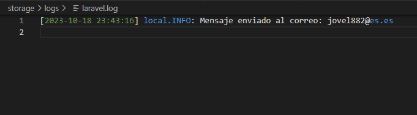

# :mount_fuji: Reto Técnico Mi Casino.

<br/>
<br/>

## :bookmark_tabs: Tabla de contenido.

<br/>
<br/>

1. [Autor.](#black_nib-autor)

<br/>
<br/>

2. [Detalle de la solución.](#triangular_ruler-detalle-de-la-solución)

<br/>
<br/>

3. [Desplegar.](#airplane-desplegar)

<br/>
<br/>

## :black_nib: Autor.

<br/>
<br/>

**John Fredy Velasco Bareño** [jovel882@gmail.com](mailto:jovel882@gmail.com)

<br/>
<br/>

## :triangular_ruler: Detalle de la solución.

<br/>
<br/>

- Está desarrollado con:

    <br/>
    <br/>

    - PHP 8.1

        <br/>
        <br/>

    - MariaDB 10.3

        <br/>
        <br/>

    - Laravel 10.28

        <br/>
        <br/>

    - Bootstrap 5

        <br/>
        <br/>

    - Laravel Octane con servidor Swoole

        <br/>
        <br/>

    - MailHog

        <br/>
        <br/>

    - Docker y Docker Compose

        <br/>
        <br/>

    Se desarrolló basado en los requerimientos descritos en el documento enviado y se consiguió lo siguiente:

    <br/>
    <br/>

    + Funcionalidades:

        <br/>
        <br/>

        + Módulos de perfil de usuario dinámico:

            <br/>
            <br/>

            + Se ubico en la raíz de sitios. Ej. [http://micasino.test/](http://micasino.test/)

                <br/>
                <br/>

                

                <br/>
                <br/>

                > Interfaz inicial sin ningún dato en la URL Ej. [http://micasino.test/](http://micasino.test/).

                <br/>
                <br/>        

                

                <br/>
                <br/>

                > Interfaz inicial responsive.

                <br/>
                <br/>

            + Cuenta con validaciones a nivel de datos recibidos por la url con un FormRequest [ValidateUrlRequest](app/Http/Requests/ValidateUrlRequest.php), aunque `todos los campos son opcionales` si se envían deben cumplir con un formato.

                <br/>
                <br/>

                + `nombre`: Debe ser un string.

                <br/>
                <br/>

                + `apellidos`: Debe ser un string.

                <br/>
                <br/>

                + `telefono`: Debe contener solo números y no menor a 10 dígitos.

                <br/>
                <br/>

                + `correo`: Debe ser un correo valido.

                <br/>
                <br/>

                + `imagen`: Debe ser una url valida.

                <br/>
                <br/>

                

                <br/>
                <br/>

                > Interfaz con errores de validación de URL Ej. [Enlace](http://micasino.test/?nombre=John%20Fredy&apellidos=Bare%C3%B1o&telefono=5732029190asdasd54&correo=jovel882gmail.com&imagen=cdn-icons-png.flaticon.com/512/3135/3135768.png).

            <br/>
            <br/>

            + Si existen datos y son correctos se cargan en la interfaz desde la URL. Ej. [Enlace](http://micasino.test/?nombre=John%20Fredy&apellidos=Bare%C3%B1o&telefono=573202919054&correo=jovel882@gmail.com&imagen=https://cdn-icons-png.flaticon.com/512/3135/3135768.png)

                <br/>
                <br/>            

                

                <br/>
                <br/>

                > Interfaz con datos en URL y sin errores Ej. [Enlace](http://micasino.test/?nombre=John%20Fredy&apellidos=Bare%C3%B1o&telefono=573202919054&correo=jovel882@gmail.com&imagen=https://cdn-icons-png.flaticon.com/512/3135/3135768.png).

                <br/>
                <br/>            

                

                <br/>
                <br/>

                > Interfaz con datos en URL y sin errores responsive.

                <br/>
                <br/>            

        + Módulos de generación de URL:

            <br/>
            <br/>

            + Se ubico en la url `/generate`. Ej. [http://micasino.test/generate](http://micasino.test/generate). <br/><br/>Además de ser la única opción dentro del menú de la interfaz web bajo el nombre de `Generar Url`.

                <br/>
                <br/>

                

                <br/>
                <br/>

                > Interfaz del formulario para generar la URL Ej. [http://micasino.test/generate](http://micasino.test/generate).

                <br/>
                <br/>                

                

                <br/>
                <br/>

                > Interfaz del formulario para generar la URL responsive.

                <br/>
                <br/>                

            + Cuenta con validaciones a nivel de Html nativo, Javascript y Backend con FormRequest [ValidateUrlGenerateRequest](app/Http/Requests/ValidateUrlGenerateRequest.php).

                <br/>
                <br/>
                
                + Validación de JS. `Todos los campos son requeridos`.

                    <br/>
                    <br/>

                    + `nombre`: Debe ser un string.

                    <br/>
                    <br/>

                    + `apellidos`: Debe ser un string.

                    <br/>
                    <br/>

                    + `telefono`: Debe contener solo números y no menor a 10 dígitos.

                    <br/>
                    <br/>

                    + `correo`: Debe ser un correo valido.

                    <br/>
                    <br/>

                    + `imagen`: Debe ser una imagen con formato (.jpg, .jpeg, .png, .gif) y de no más de `{X}`MB.

                        > :bulb: `{X}` Se determina con un Helper personalizado [UploadHelper](app/Helpers/UploadHelper.php) que toma el máximo permitido posible por el server leyendo las variables de PHP.

                    <br/>
                    <br/>

                    

                    <br/>
                    <br/>

                    > Interfaz con errores de validación de JS.                    

                    <br/>
                    <br/>

                    

                    <br/>
                    <br/>

                    > Interfaz con errores de validación de JS responsive.

                <br/>
                <br/>
                
                + Validación de Backend con FormRequest [ValidateUrlGenerateRequest](app/Http/Requests/ValidateUrlGenerateRequest.php). `Todos los campos son requeridos`.

                    <br/>
                    <br/>

                    + `nombre`: Debe ser un string.

                    <br/>
                    <br/>

                    + `apellidos`: Debe ser un string.

                    <br/>
                    <br/>

                    + `telefono`: Debe contener solo números y no menor a 10 dígitos.

                    <br/>
                    <br/>

                    + `correo`: Debe ser un correo valido.

                    <br/>
                    <br/>

                    + `imagen`: Debe ser una imagen y de no más de `{X}`MB.

                        > :bulb: `{X}` Se determina con un Helper personalizado [UploadHelper](app/Helpers/UploadHelper.php) que toma el máximo permitido posible por el server leyendo las variables de PHP.

                    <br/>
                    <br/>

                    

                    <br/>
                    <br/>

                    > Interfaz con errores de validación de Backend.                    

                    <br/>
                    <br/>

                    

                    <br/>
                    <br/>

                    > Interfaz con errores de validación de JS Backend responsive.

            <br/>
            <br/>                

            + Generación exitosa.

                <br/>
                <br/>                

                + Si todo esta correcto se carga la imagen al servidor al [storage publico](storage/app/public/) y se obtiene la url de la imagen.

                    <br/>
                    <br/>

                    > :bulb: Se utilizo el filesystem_disk local ya que no se tenía acceso a uno de terceros, pero para implementar alguno como s3 se AWS no sería más que configurar las variables de acceso y usar ese disk en el filesystem ya sea puntualmente en la carga de la imagen especificando el disco o definido de manera global con la variable de entorno FILESYSTEM_DISK del .env.

                <br/>
                <br/>

                + Se genera la URL de redirección a la interfaz de perfil dinámico.

                <br/>
                <br/>                

                + Se envía a una nueva interfaz ubicada en la url `/redirect`. Ej. [http://micasino.test/redirect](http://micasino.test/redirect) donde:

                    <br/>
                    <br/>

                    

                    <br/>
                    <br/>

                    > Interfaz con la redirección al enlace. Ej. [Enlace](http://micasino.test/redirect?url=http%3A%2F%2Fmicasino.test%3Fnombre%3DJohn%2520Fredy%26apellidos%3DBare%25C3%25B1o%26telefono%3D573202919054%26correo%3Djovel882%2540gmail.com%26imagen%3Dhttp%253A%252F%252Fmicasino.test%252Fstorage%252Fimagenes%252FEFojkOIP92vPdZKf6YzmPFTxW00LEn7nYNGJatwg.jpg)

                    <br/>
                    <br/>

                    

                    <br/>
                    <br/>

                    > Interfaz con la redirección al enlace responsive.

                    <br/>
                    <br/>

                    + Se valida que exista el parámetro `url` con la url generada y que sea válida con un FormRequest [ValidateUrlGenerateRequest](app/Http/Requests/ValidateRedirectRequest.php).

                        <br/>
                        <br/>

                        > :bulb: Esto se hizo principalmente para evitar la recarga de la página y la duplicidad en la carga de la imagen en el storage.

                        <br/>
                        <br/>                

                    + Se visualiza el link de redirección y un botón para copiar el enlace.

                    <br/>
                    <br/>                

                    + Existe un botón de redirigir que envía al enlace.

                    <br/>
                    <br/>                

                    + Existe una cuenta regresiva de 60 segundos para ser redirigido al enlace automáticamente.
                <br/>
                <br/>                

                + Finalmente si se da la redirección por cualquier método se ve el perfil dinámico con los datos cargados en el formulario incluida la imagen cargada en el storage.

                    <br/>
                    <br/>

                    

                    <br/>
                    <br/>

                    > Interfaz de perfil dinámica con la data cargada desde el formulario.

                    <br/>
                    <br/>

                    

                    <br/>
                    <br/>

                    > Interfaz con la redirección al enlace responsive.                

        <br/>
        <br/>                

        + Almacenamiento en BD.

            <br/>
            <br/>                

            + Se genero el siguiente modelo de BD para soportar los datos.

                <br/>
                <br/>

                

                <br/>
                <br/>

                + Se genero este modelo basado en relaciones por encima de una única tabla con todos los campos en ella buscando priorizar la escalabilidad, rendimiento y la no redundancia de los datos, esto aporta una optimización pensando en el manejo de grandes volúmenes de datos sobre todo en la ingesta que de acuerdo con la naturaleza de la solución tendrá más peso que la lectura. Finalmente, para poder evidenciar más dominio sobre otros conceptos que se abren a partir de tener relaciones en el modelo.

                <br/>
                <br/>

            + Para almacenar el ingreso único se hizo de esta manera:

                <br/>
                <br/>

                + Se valida que todos los datos estén presentes `(nombre, apellidos, telefono, correo e imagen)` para poder validar si es un nuevo ingreso y como previamente el formato se validó con el FormRequests [ValidateUrlRequest](app/Http/Requests/ValidateUrlRequest.php) al entrar la petición no es necesario hacerlos nuevamente en esta fase del proceso.

                <br/>
                <br/>

                + Si están presentes todos los datos se despacha un Job [ValidateIsNew](app/Jobs/ValidateIsNew.php).

                    <br/>
                    <br/>

                    > :bulb: Este Job implementa ShouldBeUnique para que no se reciban trabajos que validen los mismos datos como únicos, generando un id con un hash de la unión de los datos.
                    
                    <br/>
                    <br/>

                    + Se buscan o se inserta en cada modelo su respectivo dato haciendo uso del método de Eloquent `firstOrCreate`.

                    <br/>
                    <br/>

                    + Luego se busca si se tiene ya esa combinación de datos.

                    <br/>
                    <br/>

                    + Si ya existe no se hace nada.

                    <br/>
                    <br/>

                    + Si no existe:

                        <br/>
                        <br/>

                        + Se crea en BD.

                        <br/>
                        <br/>

                        + Se emite un evento [NewData](app/Events/NewData.php) con los datos base.

                            <br/>
                            <br/>

                            + Se suscribió un oyente [NewData](app/Listeners/SendEmail.php) que recibe el evento y su data para pasarla al servicio que envía el correo y registra en el log.

        <br/>
        <br/>                

        + Envío de email.

            <br/>
            <br/>

            + Se genero el servicio [SendEmail](app/Services/SendEmail.php), este al tener un solo método se definió con el método mágico `__invoke` para evitar redundar en el llamado.

                <br/>
                <br/>

                + Hace el envío del correo a la dirección de correo de los datos, junto al asunto `Notificación de nuevo registro.` y en el cuerpo los demás datos.

                <br/>
                <br/>

                

                <br/>
                <br/>

                > Ejemplo de correo enviado en MailHong.                

                <br/>
                <br/>

                + Tiene un sleep de 5 segundos para luego registrar el log con el envío del correo.

                <br/>
                <br/>

                

                <br/>
                <br/>

                > Ejemplo del registro en log.                

                <br/>
                <br/>

        + Performance y optimización.

            <br/>
            <br/>

            + Se implemento Laravel Octane para mejorar el tiempo de respuesta del aplicativo, se utilizó Swoole como servidor de aplicación.

                <br/>
                <br/>

                + Se uso Jmeter para hacer unas pruebas de carga enviando 1000 peticiones en un intervalo de 1 segundo:

                    <br/>
                    <br/>
                    
                    + Se enviaron los mismos parámetros todas las veces. Esto para probar sobre el escenario donde se debe crear en BD solo el primero, que sería único y los demás no, además de no generar trabajos sobre los mismos datos.

                        <br/>
                        <br/>
                        
                        > http://micasino.test/?nombre=John%20Fredy&apellidos=Bare%C3%B1o&telefono=573202919054&correo=jovel882%40gmail.com&imagen=http%3A%2F%2Fmicasino.test%2Fstorage%2Fimagenes%2Fp5c9ZLTteH6sjCsLYzhfb3wQWiVQvfMTraFK5Lmd.jpg

                        <br/>
                        <br/>

                        + Servidor web:

                            <br/>
                            <br/>

                            

                            <br/>
                            <br/>

                            > Resultados de la medición para el servidor Web en el escenario de envío de la misma data.

                            <br/>
                            <br/>

                        + Swoole con Octane:

                            <br/>
                            <br/>

                            

                            <br/>
                            <br/>

                            > Resultados de la medición para Swoole con Octane en el escenario de envío de la misma data.

                            <br/>
                            <br/>

                        + Análisis:

                            <br/>
                            <br/>

                            + Octane es más resiliente a la carga ya que pudo procesar el 100% de todas las solicitudes mientras que sin este solo se pudieron completar el 94.3%. Además, que durante la prueba solo con Octane sigue siendo funcional para pruebas manuales, el servidor normal arroja un error 502.

                                <br/>
                                <br/>

                                

                            <br/>
                            <br/>

                            + Si comparamos los promedios en los tiempos de respuesta Octane es un 24.63% más eficiente.    

                            <br/>
                            <br/>
                    
                    + Se enviaron parámetros diferentes cada vez. Esto para probar sobre el escenario donde se debe crear en BD todos ya que cada uno seria único, además de generar un trabajo por cada uno.

                        <br/>
                        <br/>
                        
                        > http://micasino/?nombre=John%20Fredy_`{$contador}`&apellidos=Bare%C3%B1o&telefono=573202919054&correo=jovel882%40gmail.com&imagen=http%3A%2F%2Fmicasino.test%2Fstorage%2Fimagenes%2Fp5c9ZLTteH6sjCsLYzhfb3wQWiVQvfMTraFK5Lmd.jpg<br/>El valor de `{$contador}` varia en cada petición iniciando 1 hasta 1000.

                        <br/>
                        <br/>

                        + Servidor web:

                            <br/>
                            <br/>

                            

                            <br/>
                            <br/>

                            > Resultados de la medición para el servidor web en el escenario de envío de data distinta.

                            <br/>
                            <br/>

                        + Swoole con Octane:

                            <br/>
                            <br/>

                            

                            <br/>
                            <br/>

                            > Resultados de la medición para Swoole con Octane en el escenario de envío de data distinta.

                            <br/>
                            <br/>
                        + Análisis:

                            <br/>
                            <br/>

                            + Octane es más resiliente a la carga ya que pudo procesar el 100% de todas las solicitudes mientras que sin este solo se pudieron completar el 73.2%. Además, que durante la prueba solo con Octane sigue siendo funcional para pruebas manuales, el servidor normal arroja un error 502.

                                <br/>
                                <br/>

                                

                            <br/>
                            <br/>

                            + Si comparamos los promedios en los tiempos de respuesta Octane es un 44.77% más eficiente.    

                            <br/>
                            <br/>

                    + La implementación con Octane fue la única que logro finalizar todos los jobs de la cola y enviar los 1000 correo correspondiente.

                        <br/>
                        <br/>

                        
                        
                        <br/>
                        <br/>

## :airplane: Desplegar.

<br/>
<br/>

El proyecto cuenta con una opción de despliegue contenerizada con Docker, para usarla siga los siguientes pasos.

<br/>
<br/>

> :loudspeaker: Se creo una imagen personalizada para el despliegue con Ocatane y Swoole alojada en Docker Hub [Enlace](https://hub.docker.com/r/jovel882/latavel-octane-swoole/).

<br/>
<br/>

> :loudspeaker: El ambiente despliega un servidor [MailHog](https://github.com/mailhog/MailHog) para poder probar los correos como servidor SMTP. Ej. [http://mail.micasino.test:8025/](http://mail.micasino.test:8025)

<br/>
<br/>


<br/>
<br/>

> Interfaz base de MailHong para visualizar los correos salientes como servidor SMTP.                

<br/>
<br/>

+ Prerrequisitos

    <br/>
    <br/>

    + **Docker >= 24.\***

    <br/>
    <br/>

    + **Docker Compose >=2.\***

    <br/>
    <br/>

    + **Git >=2.\***

    <br/>
    <br/>

+ Pasos

    <br/>
    <br/>

    > :bulb: Si está sobre algún sistema basado en Linux y ejecuta la siguiente línea, se iniciará un ambiente totalmente funcional sobre el DNS [micasino.test](http://micasino.test/).

    <br/>
    <br/>

    ```sh
    git clone https://github.com/jovel882/miCasino.git && cd miCasino && cp Docker/.env.example Docker/.env && docker compose -f Docker/docker-compose.yml up -d && docker logs -f micasino
    ```

    <br/>
    <br/>

    <br/>
    <br/>

    + Clone el repositorio

        <br/>
        <br/>

        ```sh
        git clone https://github.com/jovel882/miCasino.git
        ```

        <br/>
        <br/>

    + Ingrese al folder del proyecto.

        <br/>
        <br/>

        ```sh
        cd miCasino
        ```

        <br/>
        <br/>
            
    + Cree el archivo de entorno basados en el de ejemplo.

        <br/>
        <br/>

        + Genere el ***.env*** dentro del folder de **Docker**, estas son las variables disponibles.

            <br/>
            <br/>

            ```sh
            cp Docker/.env.example Docker/.env
            ```

            <br/>
            <br/>
            
            + `COMPOSE_PROJECT_NAME` (\*Requerido): Define el nombre del proyecto que se genera con Docker Compose, en el ejemplo se deja **mi_casino**.

            <br/>
            <br/>
            
            + `MYSQL_DATABASE` (\*Requerido): Define el nombre de la base de datos que se creará.

            <br/>
            <br/>
            
            + `MYSQL_ROOT_PASSWORD` (\*Requerido): Define la contraseña del usuario root del motor de base de datos. **NOTA: No dejar vacío**.

            <br/>
            <br/>

    + Variables dentro del archivo **"docker-compose.yml"**.

        <br/>
        <br/>

        + Dentro del servicio de nombre **"mh_micasino"** en la sección de **"environment"**

            <br/>
            <br/>

            + `VIRTUAL_HOST` (\*Requerido): Define el nombre del DNS sobre el que se levantara el servidor de [MailHog](https://github.com/mailhog/MailHog), por defecto esta **mail.micasino.test**.
                
        <br/>
        <br/>

        + Dentro del servicio de nombre **"micasino"** en la sección de **"environment"**

            <br/>
            <br/>

            + `VIRTUAL_HOST` (\*Requerido): Define el nombre del DNS sobre el que se levantará el ambiente, por defecto se utiliza **micasino.test**.
                
            <br/>
            <br/>

    + Ejecute el archivo docker-compose.yml para levantar el ambiente.
    
        <br/>
        <br/>

        ```sh
        docker compose -f Docker/docker-compose.yml up -d
        ```

        <br/>
        <br/>

    + Siga el estado del despliegue del contenedor principal con el siguiente comando.

        <br/>
        <br/>

        ```sh
        docker logs -f micasino
        ```

        <br/>
        <br/>

        > :pushpin: En este log, si todo está correcto, podrá ver la construcción de la imagen de Docker, instalación de paquetes con Composer, instalación de paquetes con NPM, compilado de archivos con NPM, ejecución de migraciones, ejecución de seeders y finalmente el inicio de los servicios del servidor web, work de las queues y servidor swoole de octane con Supervisor, entre otros.

        <br/>
        <br/>

    + Agregue el registro del host para redirigir las peticiones al **DNS** que se definió en **VIRTUAL_HOST** del archivo **"docker-compose.yml"**. En este [enlace](https://www.siteground.es/kb/archivo-hosts/) hay una forma de hacerlo dependiendo de su sistema operativo.

        <br/>
        <br/>
        
        **Ejemplo:**    

        <br/>
        <br/>

        ```sh

        127.0.0.1 micasino.test
        127.0.0.1 mail.micasino.test

        ```

    <br/>
    <br/>

    + Acceda al resultado de la solución **http://{DNS}**, donde **DNS** debe ser reemplazado por el que se definió en **VIRTUAL_HOST** del archivo **"docker-compose.yml"**. Ej. [http://micasino.test](http://micasino.test)

    <br/>
    <br/>

    + Acceda al servidor MailHog **http://{DNS}:8025/** donde **DNS** se debe cambiar por el que se definió en **VIRTUAL_HOST** del archivo **"docker-compose.yml"**. Ej. [http://mail.micasino.test:8025/](http://mail.micasino.test:8025)

    <br/>
    <br/>
